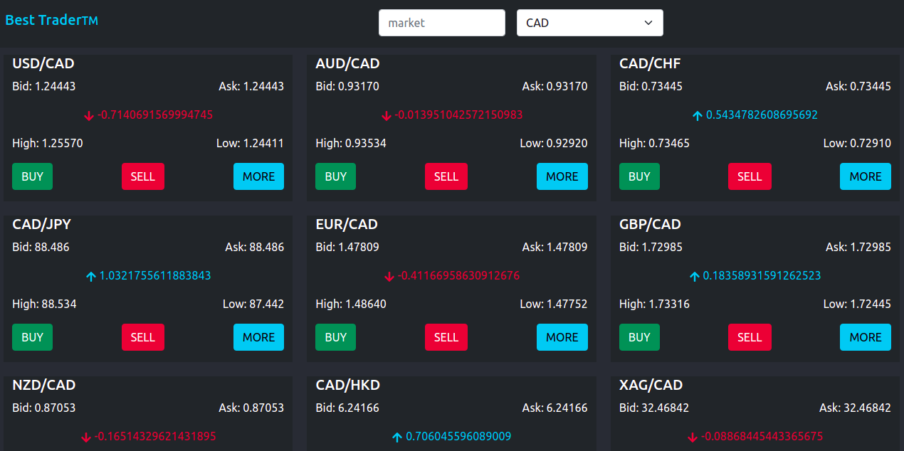

# Catalogue of Dog Clothes

# Best Trader

A React Redux app which fetches data from API endpoint and displays this data on the main page based on a filter if any.
Also, it uses React Redux Routes to navigate about the app. To achieve these, I used

- functional components
- components lifecycle methods
- state and props
- testing
- store
- thunks
- hooks
- prop types
- actions
- reducers

## [Live](https://best-trader-markets.netlify.app/)

## Project Videos

- [Video Presentation](https://www.loom.com/share/5a02991208314a31a252df7a32bcaaff)

## Built With

- JavaScript
- React
- Redux
- Bootstrap
- Jest
- HTML
- CSS

## Getting Started

To set up a local copy of the project

- `https://github.com/wandji20/best-trader-redux.git`
- `best-trader-redux`
- `npm install`

### Run tests

- Go to your terminal
- Run `npm test src/test` to run all the tests.

## Run locally

- Now you are ready to run a local server
- Go to your command line and put `npm start`
- Go to https://localhost:3000/
- Try it!!

## Author

👤 **Wandji Bertrand**

- Github: [@wandji20](https://github.com/wandji20)
- Twitter: [@wandjibertrand](https://twitter.com/wandjibertrand)
- Linkedin: [Linkedin](https://www.linkedin.com/in/wandji-bertrand/)

## 🤝 Contributing

Contributions, issues, and feature requests are welcome!

## Show your support

Give a ⭐️ if you like this project!

## 📝 [License](LICENSE)
